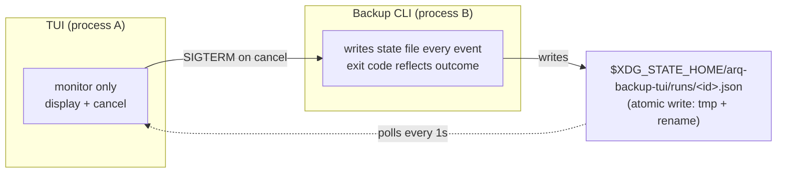
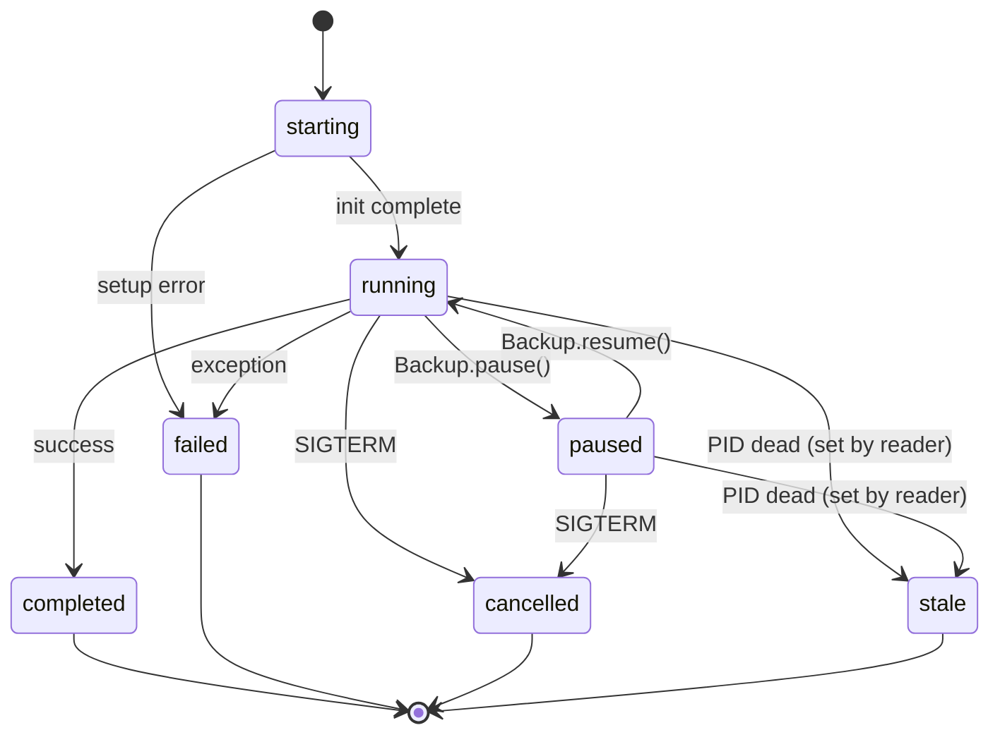
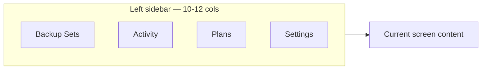

# CLI / TUI split + external-process monitoring + Arq 7 GUI mimicry

## 0. Motivation

The current architecture has the TUI run backup / restore / verify
directly inside its own worker threads (`BackupWorker`, `RestoreWorker`,
`ValidateWorker` are all in-process). This model blocks two usage
scenarios:

1. **Unattended execution such as cron**. A backup needs to run
   periodically without a TUI, and although the `arq-backup` CLI exists
   today, there is no way to observe its progress from the outside.
2. **Inspecting an already-running backup**. When the operator has
   started a backup in one terminal and wants to open the TUI in
   another window to watch progress / current file / failure list,
   there is no channel for the two processes to communicate.

This is also how Arq 7's macOS GUI already works — `Arq.app` itself
runs the backup as one process, and the user-facing GUI observes and
controls that process. This project follows the same model.

## 1. Shipping outcomes

The PR series listed in §6 is **complete** as of mid-2026-05.
Every scenario below works today.

```sh
# Scenario A — cron-friendly (no TUI)
arq-backup create ~/Documents \
    --dest /Volumes/arq --password "$ARQ_PW" \
    --state-file ~/.local/state/arq-backup-tui/runs/foo.json
# → progress recorded to the state file; on exit status=completed/failed
# → notify_run_finished() fires automatically (osascript / notify-send /
#   shell hook depending on platform + ~/.config/arq-backup-tui/notifications.json)

# Scenario B — operator monitors from a separate terminal
./arq-tui.py
# Press 'a' to open the Activity Monitor screen → all active and
# recently finished runs that were started via Scenario A are listed.
# Progress / current file / ETA refresh every 1 second.

# Scenario C — start a new backup from inside the TUI (existing behavior + spawn mode)
./arq-tui.py → [n]ew plan → wizard → [r]un
# Default is subprocess spawn (same IPC as the CLI); legacy in-process is also an option.
# On worker finish/fail, plan.last_run_iso is stamped + macOS toast fires + notification dispatches.

# Scenario D — post-mortem analysis of a finished run
./arq-tui.py → Activity → select a completed run
# events log + final stats + failed entries from the state file are surfaced.

# Scenario E — dry-run preview before committing to a restore
arq-reader restore /Volumes/arq <folder-uuid> /tmp/dummy \
    --password-env ARQ_PW --list-only --paths Documents/notes
# → walks tree, emits would_restore_file events, prints
#   {files_listed, bytes_would_restore, sample_paths} JSON; never writes.

# Scenario F — incremental audit (skip already-confirmed blob_ids)
arq-validator audit /Volumes/arq --password-env ARQ_PW --incremental
# → first run walks everything; subsequent runs skip ledger-known blobs.
arq-validator record --record-path /<cu>/backupfolders/<fu>/.../*.backuprecord \
    /Volumes/arq --password-env ARQ_PW --incremental --ledger-prune-days 30
# → record-tier accepts the same ledger; --ledger-prune-days drops aged entries.
```

### Event kinds added by PRs #36–#41

- ``would_restore_file`` / ``would_restore_dir`` /
  ``dry_run_restore_started`` / ``dry_run_restore_finished`` /
  ``dry_run_tree_error`` — emitted by ``Restore.dry_run_restore``.
- ``file_read_error`` (with ``op={read_bytes,readlink,lstat}``)
  + ``file_stat_error`` / ``dir_stat_error`` (with ``op=post_*_stat``,
  ``recovery=defaulted_metadata``) — walker safety hardening (PR #37).
- ``audit_file_skipped`` (with ``reason=ledger``) — incremental
  audit short-circuit (PR #36, #39).

## 2. Process model



Core principles:
- **One-way communication only**: the CLI only writes the state file;
  the TUI only reads. Without bidirectional IPC (locks etc.), race
  conditions are cleanly avoided.
- **Atomic write**: every state-file change uses `write tmp + rename`.
  Partial reads cannot happen.
- **Cancellation**: to request a cancel, the TUI sends `SIGTERM` to
  the CLI's PID. The CLI handles it as a graceful cancel (the
  `Backup.cancel` mechanism already exists).
- **Liveness check**: the TUI verifies the state file's PID is alive
  with `kill(pid, 0)`. If the process is dead but status=running, it
  is shown as "stale".

## 3. State file format

### 3.1 Status state machine

A run transitions through these states. Producers set status
forward only; the reader sets ``stale`` retroactively when it
detects a dead PID with status still ``running`` (or
``paused``). Terminal states (``completed`` / ``failed`` /
``cancelled`` / ``stale``) never transition out.



### 3.2 JSON schema

```jsonc
// ~/.local/state/arq-backup-tui/runs/<run-id>.json
{
  "schema_version": 1,
  "run_id": "01J…UUID",                 // ULID or UUIDv7
  "kind": "backup|restore|validate",
  "status": "starting|running|paused|completed|failed|cancelled|stale",
  "started_at": 1771678551,             // unix epoch sec
  "finished_at": null,                  // null while running
  "pid": 12345,
  "host": "home-laptop.local",          // for multi-host destinations
  "plan_id": "UUID-or-null",            // backup mode only
  "plan_name": "home-laptop-to-nas",
  "destination": {
    "kind": "local|sftp",
    "label": "/Volumes/arq",
    "computer_uuid": "..."
  },
  "progress": {
    "files_total": null,                // null when planning incomplete
    "files_done": 1234,
    "bytes_total": null,
    "bytes_done": 5678901,
    "current_path": "/Users/.../foo.txt",
    "throughput_bps": 4_512_000,
    "eta_sec": 1247
  },
  "result": null,                       // populated on terminal status
  "events_tail": [                      // last N events (ring buffer)
    {"t": 1771678555, "kind": "file_written", "path": "...", "size": 1024},
    ...
  ],
  "error": null                         // string when status=failed
}
```

Update policy:
- Refresh progress + events_tail (last 50) on every `ProgressCb` event
- I/O throttling: trigger on whichever comes first — every 1 second or every 100 events
- On termination, immediately flush status + result + finished_at

## 4. CLI entry-point changes

| CLI | Change |
|---|---|
| `arq-backup create` | New `--state-file <path>` option. If empty, defaults to `$XDG_STATE_HOME/arq-backup-tui/runs/<auto-uuid>.json`. The CLI writes status=starting at startup, refreshes progress on every `ProgressCb`, and records status=completed/failed at exit |
| `arq-reader restore` | Same |
| `arq-validator` | Same |
| (new) `arq-tui-runs ls` | List active/recent runs (CLI entry point) |
| (new) `arq-tui-runs show <run-id>` | Detail for a single run |
| (new) `arq-tui-runs cancel <run-id>` | Send SIGTERM to the PID |
| (new) `arq-tui-runs gc` | Clean up state files for finished runs older than 30 days |

## 5. TUI changes

### 5.1 New screen: `RunsMonitorScreen`

Layout sketch — the screen has an "Active" section (running
backups with progress + ETA + cancel) and a "Recent" section
(last 24h, completed + failed):

```
Activity
========
Active
  ▶ home-laptop-to-nas    [████░░░░░░] 41%  3:21 ETA  [c]ancel
  ▶ docs-to-sftp          [██░░░░░░░░] 18%  9:12 ETA  [c]ancel
Recent (last 24h)
  ✓ home-laptop-to-nas    completed 02:14 → 03:08 (54m)
  ✗ pictures-to-nas       failed    01:30 → 01:31 (network)

[n]ew run  [r]efresh  [g]c old  [Enter] details  [Esc] back
```

- Polling at 1Hz; state-file changes are detected by mtime comparison
- Active and Recent are displayed separately
- `Enter` opens single-run details → events_tail + failed entries

### 5.2 Existing BackupRunScreen / RestoreRunScreen / ValidateRunScreen

Converted to dual-mode:
- **Default (spawn)**: launch the CLI via subprocess.Popen and watch the state file
- **Legacy (`--in-process`)**: the existing worker-thread approach (for tests/debugging)

This way the new spawn mode runs through the exact same code path as
the cron scenario — whether the run is started from inside the TUI or
from cron, the IPC is identical.

### 5.3 Sidebar (Arq 7 GUI mimicry)



- Left sidebar (10–12 cols wide) with 4 sections
- For Arq 7-style visual weight, the active section uses an accent color
- Keyboard shortcuts (`1`–`4`) switch sidebar sections
- `t` toggles the sidebar (hide / show)

### 5.4 Color and spacing (Arq 7 GUI feel)

| Element | Arq 7 look | This TUI mapping |
|---|---|---|
| Sidebar background | dark gray | `$panel-darken-1` |
| Active row | light blue | `$accent` |
| Progress bar | blue gradient | Custom Textual `ProgressBar` colors |
| Status icons | ✓ ✗ ⏸ ⏵ | Same unicode + color |
| Font weight | sidebar bold, content regular | Use `text-style: bold` |

## 6. Migration phases (per PR)

| Phase | Deliverable | Depends on |
|---|---|---|
| **P0 (this PR)** | This design doc plus the `arq_tui/runs.py` module (state-file I/O + unit tests) | - |
| **P1** | CLIs gain `--state-file` support; `RunsMonitorScreen` is added (read-only) | P0 |
| **P2** | Existing BackupRunScreen and friends operate in spawn mode (legacy in-process retained) | P1 |
| **P3** | Sidebar + Arq 7 color palette applied | P1, P2 |
| **P4** | `arq-tui-runs` CLI (ls/show/cancel/gc) | P0 |
| **P5** | (optional) cron-friendly helper: `arq-tui-cron` command to register a plan and create a system cron entry | P1 |

## 7. Compatibility and safety considerations

- **State-file location standard**: `$XDG_STATE_HOME/arq-backup-tui/runs/`.
  XDG is non-standard on macOS, so fall back to
  `~/.local/state/arq-backup-tui/`.
- **Keep the existing `--in-process` mode**: the test suite uses it, so
  keep it as the default option through P3. After P3, spawn becomes
  the default.
- **Stale state files**: a file with status=running but a dead PID is
  shown as "stale" in the TUI and the operator can clean it up
  manually. The automatic cleanup (`gc`) only touches finished entries
  older than 30 days.
- **PII protection**: `current_path` in the state file contains the
  operator's actual file path. `chmod 0600` is recommended. events_tail
  is also capped at 50 entries — it does not grow unboundedly.
- **Multi-host**: when several machines back up to the same destination,
  the state file's `host` field disambiguates them. State files are
  host-local (each machine has its own XDG_STATE_HOME), so they do not
  collide.

## 8. Notes

- Every **in-screen worker** in the TUI (workers.py) becomes spawn-only
  after P2. Legacy mode stays as an escape hatch via an environment
  variable like `ARQ_TUI_IN_PROCESS=1`.
- `:run <plan>` in `arq_tui/console_commands.py` also uses spawn mode.
- The in-process runner used by the existing integration tests
  (`test_arq_real_destination.py` and friends) is left as is — moving
  them onto CLI subprocess + state-file polling would make the CI
  setup needlessly complex.
